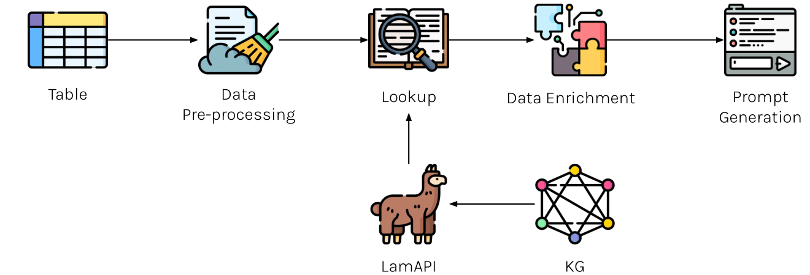

# Datasets

The dataset has been constructed using the datasets available from the SemTab challenges. The datasets employed for the analysis include:

1. **WikidataTables 2023:** which consists of tables generated using SPARQL queries to create realistic-looking tables. It includes Test and Validation tables, but only the Validation tables are used because ground truth is provided. The target knowledge graph (KG) for this dataset is Wikidata, and the tasks remain the same as in previous years: Cell Entity Annotation (CEA), Column Type Annotation (CTA), and Column Property Annotation (CPA). ([semtab 2023](https://drive.google.com/drive/folders/1LDp2AZToVae7wLOu2nfXWfBHJbwHeIWu?usp=sharing))
2. **HardTables 2022:** The dataset consists of tables generated using SPARQL queries targeting Wikidata. As in previous years, the tasks associated with this dataset were Column Entity Annotation (CEA), Column Type Annotation (CTA), and Column Property Annotation (CPA). ([semtab 2022](https://drive.google.com/drive/folders/1Bn21CUK8sYPOgz5gnIM6kx269pOJ-2xF?usp=sharing))
3. **SemTab 2020:** SemTab 2020 consisted of four evaluation rounds, with each round progressively increasing the complexity of the datasets. The first three rounds used AIcrowd for automated solution evaluation, utilizing an automatic dataset generator. In contrast, Round 4 was a blind round with no AIcrowd evaluation. It included both an automatically generated dataset, similar to earlier rounds, and the Tough Tables dataset for CEA and CTA tasks. ([semtab 2020](https://drive.google.com/drive/folders/10CspQ2HErEUtpz3Zl5tLUtJ7itmft9Xf?usp=sharing))

The new dataset, enriched with candidates extracted from `LamAPI`, has been built by including the tables extracted from the SemTab datasets listed above. Finally, it consists of $140,800$ tables, distributed among training, test, and validation sets in proportions of $70\%$, $20\%$, and $10\%$, respectively. The new [training](https://drive.google.com/file/d/1-ZWGFHAVedp7U104ZYqLcark-_3uDfkR/view?usp=sharing) and [test](https://drive.google.com/file/d/11MTwGsdyqaVW1AP7iPObJH3cmO1vA5Zh/view?usp=sharing) datasets are publicily available.
